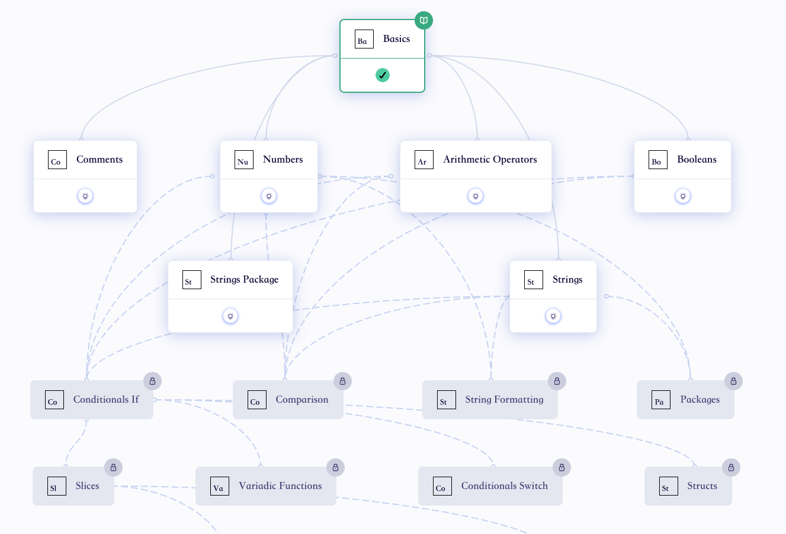
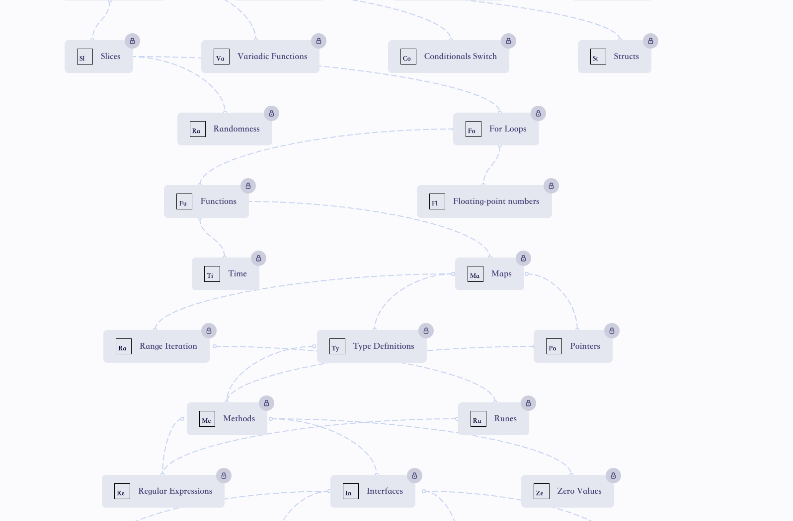
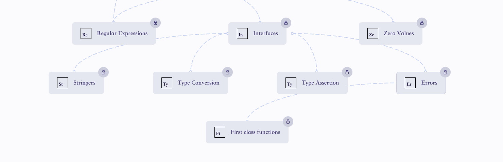

# 大纲




# Go 并发学习


## goroutine

代码学习:
```go
package concurrency

import (
	"fmt"
	"time"
)

func f(from string) {
	for i := 0; i < 3; i++ {
		fmt.Println(from, ":", i)
	}
}

func goroutine() {
	// Suppose we have a function call `f(s)`. Here's how
	// we'd call that in the usual way, running it
	// synchronously.
	f("direct")

	// To invoke this function in a goroutine, use
	// `go f(s)`. This new goroutine will execute
	// concurrently with the calling one.
	go f("goroutine")

	// You can also start a goroutine for an anonymous
	// function call.
	go func(msg string) {
		fmt.Println(msg)
	}("going")

	// Our two function calls are running asynchronously in
	// separate goroutines now. Wait for them to finish
	// (for a more robust approach, use a [WaitGroup](waitgroups)).
	time.Sleep(time.Second)
	fmt.Println("done")
}

```

输出结果：
```
Running tool: /usr/local/go/bin/go test -timeout 30s -run ^Test_goroutine$ goway/basic/concurrency

=== RUN   Test_goroutine
direct : 0
direct : 1
direct : 2
going
goroutine : 0
goroutine : 1
goroutine : 2
done
--- PASS: Test_goroutine (1.00s)
PASS
ok      goway/basic/concurrency 1.299s
```

